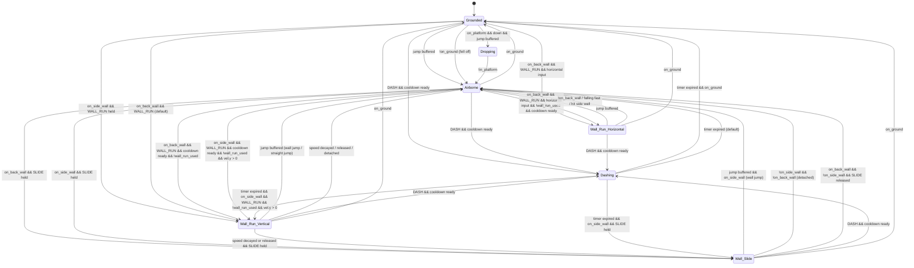

# Player FSM

```mermaid
stateDiagram-v2
    [*] --> Grounded

    Grounded --> Airborne : jump buffered
    Grounded --> Airborne : !on_ground (fell off)
    Grounded --> Dropping : on_platform && down && jump buffered
    Grounded --> Dashing : DASH && cooldown ready
    Grounded --> Wall_Run_Vertical : on_side_wall && WALL_RUN held
    Grounded --> Wall_Run_Horizontal : on_back_wall && WALL_RUN && horizontal input
    Grounded --> Wall_Run_Vertical : on_back_wall && WALL_RUN (default)

    Airborne --> Grounded : on_ground
    Airborne --> Dashing : DASH && cooldown ready
    Airborne --> Wall_Run_Horizontal : on_back_wall && WALL_RUN && horizontal input && !wall_run_used && cooldown ready
    Airborne --> Wall_Run_Vertical : on_back_wall && WALL_RUN && cooldown ready && !wall_run_used
    Airborne --> Wall_Slide : on_back_wall && SLIDE held
    Airborne --> Wall_Run_Vertical : on_side_wall && WALL_RUN && cooldown ready && !wall_run_used && vel.y > 0
    Airborne --> Wall_Slide : on_side_wall && SLIDE held

    Wall_Slide --> Airborne : jump buffered && on_side_wall (wall jump)
    Wall_Slide --> Airborne : !on_side_wall && !on_back_wall (detached)
    Wall_Slide --> Airborne : on_back_wall && !on_side_wall && SLIDE released
    Wall_Slide --> Dashing : DASH && cooldown ready
    Wall_Slide --> Grounded : on_ground

    Wall_Run_Vertical --> Airborne : jump buffered (wall jump / straight jump)
    Wall_Run_Vertical --> Airborne : speed decayed / released / detached
    Wall_Run_Vertical --> Wall_Slide : speed decayed or released && SLIDE held
    Wall_Run_Vertical --> Dashing : DASH && cooldown ready
    Wall_Run_Vertical --> Grounded : on_ground

    Wall_Run_Horizontal --> Airborne : jump buffered
    Wall_Run_Horizontal --> Airborne : !on_back_wall / falling fast / hit side wall
    Wall_Run_Horizontal --> Dashing : DASH && cooldown ready
    Wall_Run_Horizontal --> Grounded : on_ground

    Dashing --> Grounded : timer expired && on_ground
    Dashing --> Wall_Run_Vertical : timer expired && on_side_wall && WALL_RUN && !wall_run_used && vel.y > 0
    Dashing --> Wall_Slide : timer expired && on_side_wall && SLIDE held
    Dashing --> Airborne : timer expired (default)

    Dropping --> Airborne : !in_platform
```
