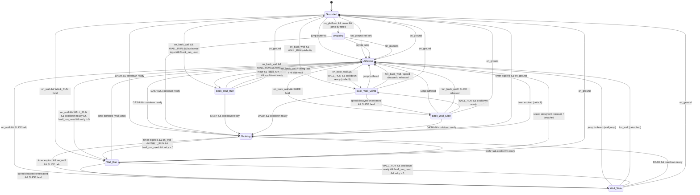

# Player FSM

```mermaid
stateDiagram-v2
    [*] --> Grounded

    Grounded --> Airborne : jump buffered
    Grounded --> Airborne : !on_ground (fell off)
    Grounded --> Dropping : on_platform && down && jump buffered
    Grounded --> Dashing : DASH && cooldown ready
    Grounded --> Wall_Run : on_wall && WALL_RUN held
    Grounded --> Back_Wall_Run : on_back_wall && WALL_RUN && horizontal input && !back_run_used
    Grounded --> Back_Wall_Climb : on_back_wall && WALL_RUN (default)

    Airborne --> Grounded : on_ground
    Airborne --> Dashing : DASH && cooldown ready
    Airborne --> Wall_Run : on_wall && WALL_RUN && cooldown ready && !wall_run_used && vel.y > 0
    Airborne --> Wall_Slide : on_wall && SLIDE held
    Airborne --> Back_Wall_Run : on_back_wall && WALL_RUN && horizontal input && !back_run_used && cooldown ready
    Airborne --> Back_Wall_Climb : on_back_wall && WALL_RUN && cooldown ready (default)
    Airborne --> Back_Wall_Slide : on_back_wall && SLIDE held

    Wall_Slide --> Airborne : jump buffered (wall jump)
    Wall_Slide --> Airborne : !on_wall (detached)
    Wall_Slide --> Wall_Run : WALL_RUN && cooldown ready && !wall_run_used && vel.y > 0
    Wall_Slide --> Dashing : DASH && cooldown ready
    Wall_Slide --> Grounded : on_ground

    Wall_Run --> Airborne : jump buffered (wall jump)
    Wall_Run --> Airborne : speed decayed / released / detached
    Wall_Run --> Wall_Slide : speed decayed or released && SLIDE held
    Wall_Run --> Dashing : DASH && cooldown ready
    Wall_Run --> Grounded : on_ground

    Dashing --> Grounded : timer expired && on_ground
    Dashing --> Wall_Run : timer expired && on_wall && WALL_RUN && !wall_run_used && vel.y > 0
    Dashing --> Wall_Slide : timer expired && on_wall && SLIDE held
    Dashing --> Airborne : timer expired (default)

    Dropping --> Airborne : coyote jump
    Dropping --> Airborne : !in_platform
    Dropping --> Dashing : DASH && cooldown ready

    Back_Wall_Run --> Airborne : jump buffered
    Back_Wall_Run --> Airborne : !on_back_wall / falling fast / hit side wall
    Back_Wall_Run --> Dashing : DASH && cooldown ready
    Back_Wall_Run --> Grounded : on_ground

    Back_Wall_Climb --> Airborne : jump buffered
    Back_Wall_Climb --> Airborne : !on_back_wall / speed decayed / released
    Back_Wall_Climb --> Back_Wall_Slide : speed decayed or released && SLIDE held
    Back_Wall_Climb --> Dashing : DASH && cooldown ready
    Back_Wall_Climb --> Grounded : on_ground

    Back_Wall_Slide --> Airborne : jump buffered
    Back_Wall_Slide --> Airborne : !on_back_wall / SLIDE released
    Back_Wall_Slide --> Back_Wall_Climb : WALL_RUN && cooldown ready
    Back_Wall_Slide --> Dashing : DASH && cooldown ready
    Back_Wall_Slide --> Grounded : on_ground
```
